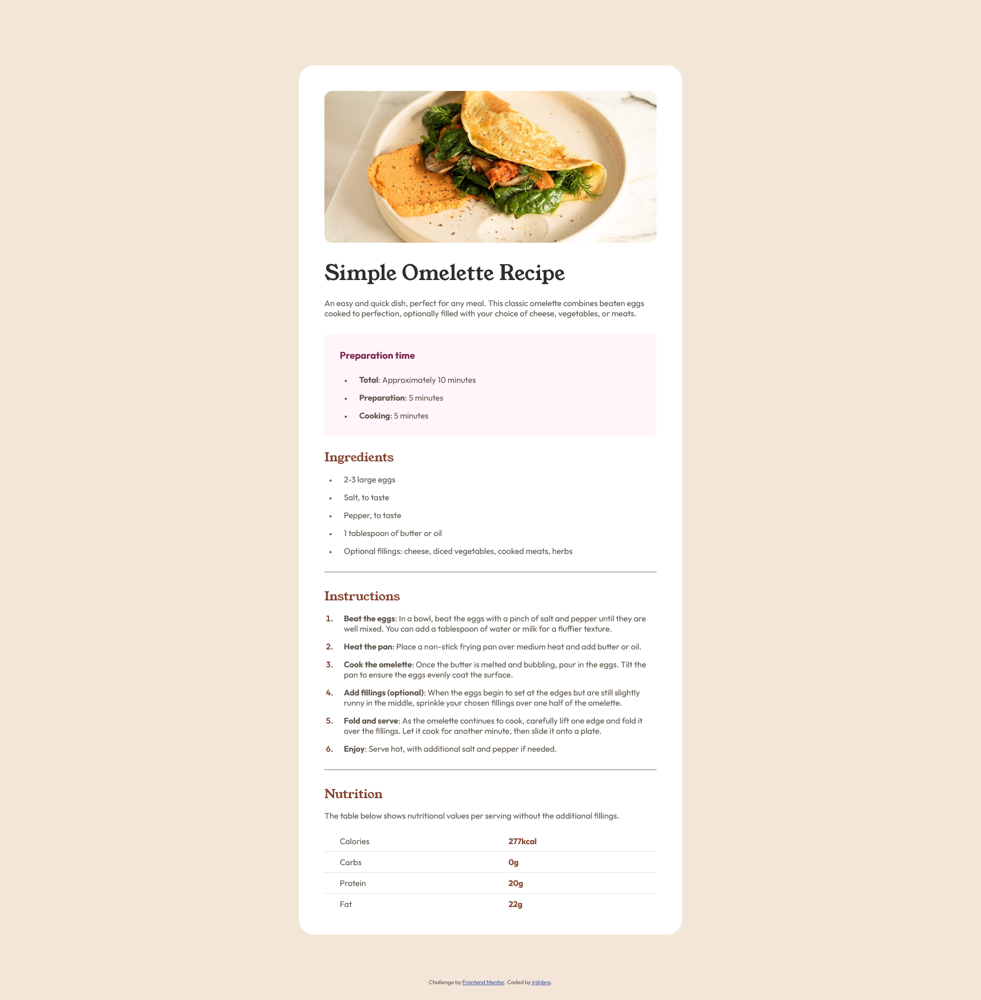

# Frontend Mentor - Recipe page solution

This is a solution to the [Recipe page challenge on Frontend Mentor](https://www.frontendmentor.io/challenges/recipe-page-KiTsR8QQKm). Frontend Mentor challenges help you improve your coding skills by building realistic projects. 

## Table of contents

- [Overview](#overview)
  - [Screenshot](#screenshot)
  - [Links](#links)
- [My process](#my-process)
  - [Built with](#built-with)
  - [What I learned](#what-i-learned)
  - [Useful resources](#useful-resources)

## Overview

### Screenshot

### Links

- Solution URL: https://www.frontendmentor.io/solutions/recipe-page-coW4gd7pnX
- Live Site URL: https://jrdnbrg.github.io/recipe-page/

## My process

### Built with

- Semantic HTML5 markup
- Flexbox

### What I learned

There are three important things I learned because of this project. 

Firstly, I learned how to use `
` tag, because I had never used dividers before. I struggled with making the dividers between sections visible. I did not understand why they were not visible, because other dividers on the page were visible. Eventually, I discovered the issue was caused by using flexbox. That made me realize I did not need flexbox on the `<main>` part of the page, so I removed it and therefore the dividers became visible. 

Secondly, I learned how to style lists. I had used lists before, but never styled them. These are the major things I learned:
- Using the marker pseudo-element to change the color and size of the marker.
- Changing the position of the list marker by setting `padding: 0` and adding `margin-left`.
- Increasing the space between the marker and the text of a list item, by adding `paddding-left` to the `li` element.
- Using `margin-top` with an adjacent siblings selector to set the space between list items, instead of setting the `line-height`.

Thirdly, I learned about tables to make the nutrition table. First I made the table without using the `<table>` tag. However, I then learned about the `<table>` tag and implemented it, because I want to use as much semantic HTML as possible.

### Useful resources

- [The Disappearing Line (a CSS Mystery)](https://dev.to/alvaromontoro/the-disappearing-line-a-css-mystery-3e35) - This helped me figure out why some of the dividers were not visible.
- [W3Schools](https://www.w3schools.com/) - This website helped me very much with learning about styling lists and using tables.
